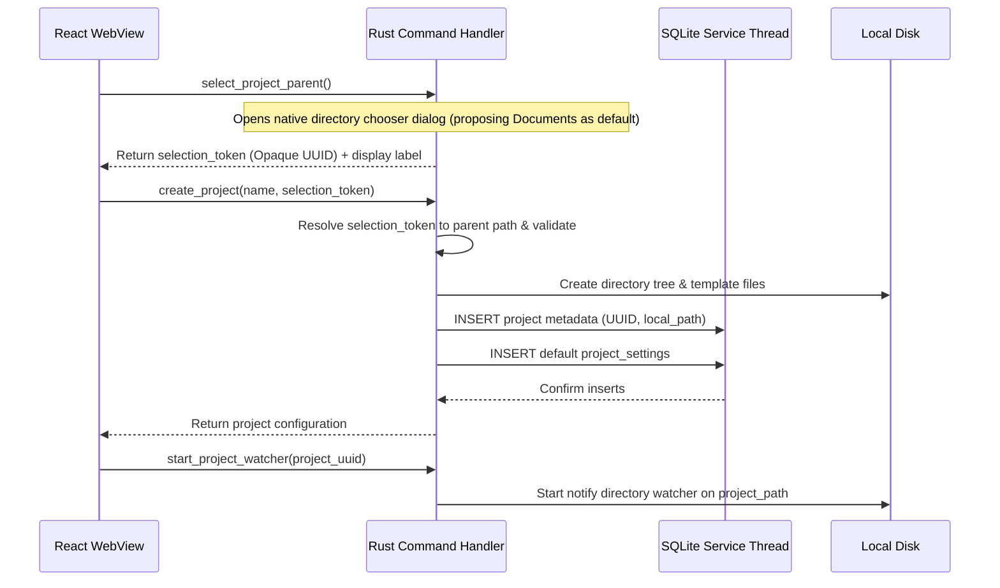
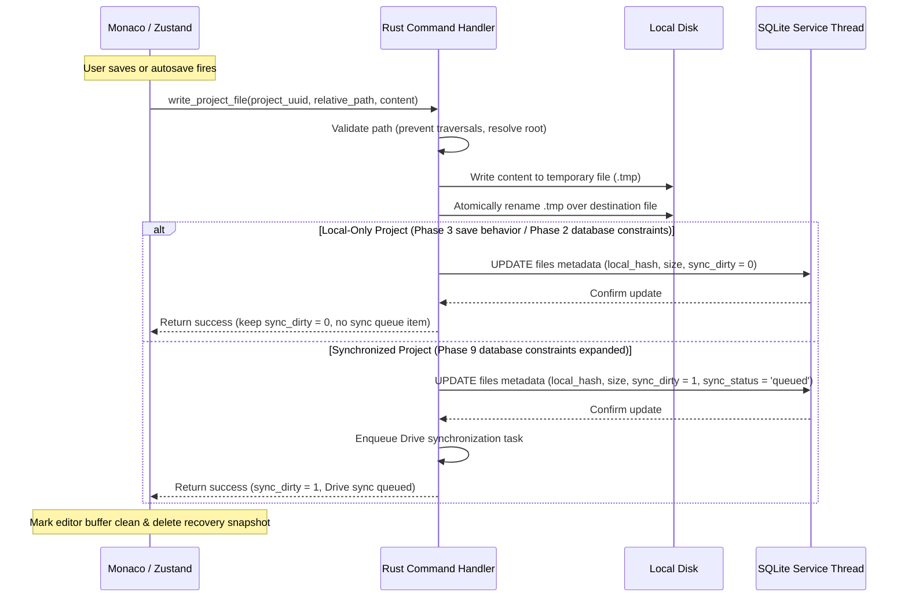
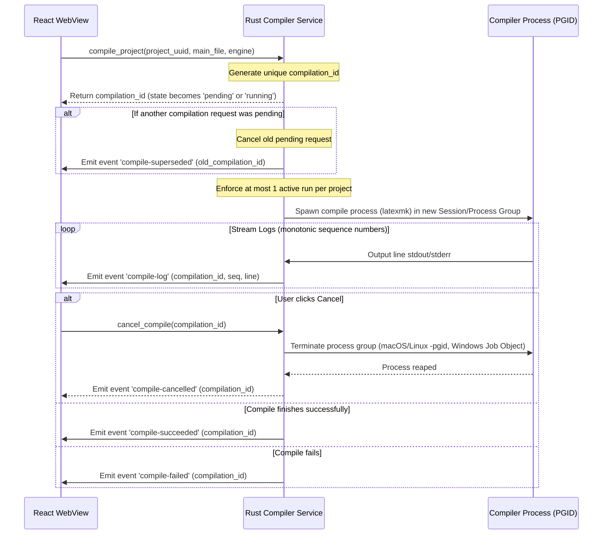
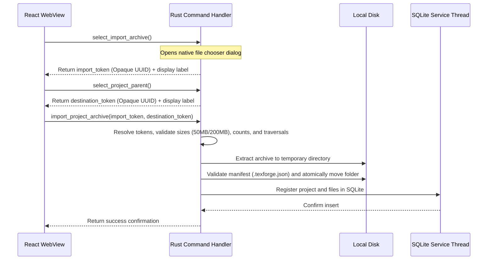
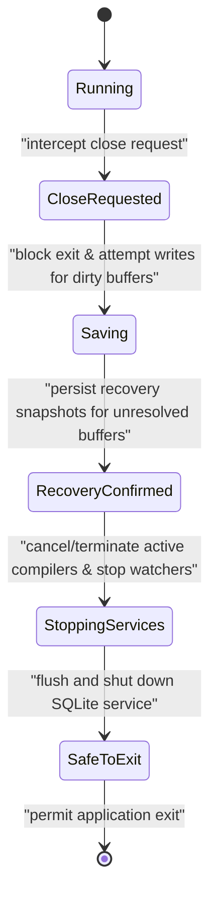

# TeXForge Architectural Design

> [!NOTE]
> This document describes the approved target architecture. Except where explicitly marked as verified, the subsystems described here are planned and not yet implemented.

TeXForge is a secure, local-first desktop LaTeX editor built using **Tauri 2** (Rust native core) and **React** (HTML5 WebView frontend).

---

## 1. System Topology & Security Boundaries

The system topology enforces strict security sandboxing between the WebView user interface and the host operating system.

* **No Arbitrary Frontend Shell Execution**: The React frontend cannot invoke arbitrary system shell commands or executables. All compilation runs through a dedicated Rust compiler service executing validated compiler binaries.
  * The Rust backend intentionally executes validated compiler binaries.
  * React cannot choose arbitrary executables.
  * React cannot supply unrestricted command-line arguments.
  * Executable paths come from compiler detection, trusted settings, or bundled sidecar configuration.
  * Compiler arguments are assembled and validated in Rust.
  * Shell invocation is avoided where direct process execution is possible (e.g. executing pdflatex or tectonic directly without a shell wrapper).
  * If Tauri sidecar packaging is used for Tectonic, any shell-plugin permission is scoped only to the exact bundled sidecar and validated arguments. React never imports or calls shell APIs.
* **Explicit Tauri 2 Capability Boundary**: Desktop permissions are defined in `src-tauri/capabilities/default.json` and referenced intentionally from `tauri.conf.json`. React does not use the filesystem plugin for project files; all filesystem work is Rust-owned.
* **No Client SQL Access**: React has no direct connection to the database and cannot issue arbitrary SQL queries. All database operations are exposed as typed Rust commands.
* **Opaque File System Tokens**: React has no access to raw, absolute filesystem paths on the host machine. Directory and file selection dialogs are managed in Rust commands. Rust returns an opaque selection token (UUID) representing the selected directory or archive, along with a sanitized display label.
* **Preferred Path Wording & Security Policy**:
  * Rust stores the authoritative absolute path internally.
  * React receives only an opaque selection token and a sanitized display label (e.g. selected directory name or abbreviated user-facing location).
  * React never sends the display label or display path back to Rust as authorization.
  * Only the opaque token authorizes the subsequent operation.
  * Selection tokens are single-purpose, single-use, bound to the operation type, bound to the current application session, expired after a short timeout, and consumed immediately after successful or failed terminal use.
  * If a path is displayed in the UI for usability, it is presentation-only, not accepted by filesystem commands, and changing the displayed string grants no access; Rust resolves only the opaque token.
  * This policy applies to user-selected external filesystem locations, including: new-project parent selection, external-folder registration, import archive selection, export destination selection, and trusted compiler executable selection (if supported). Opening or revealing an already registered project does not require a selection token; instead, the frontend submits the `project_uuid` or `file_uuid`, and the Rust backend resolves the authoritative registered path from the SQLite database.
  * For new project creation, Rust opens a trusted native parent-directory chooser, proposing the platform Documents directory as the initially suggested/default directory. The selected parent is authorized through an opaque single-use token, and the frontend never submits an unrestricted absolute path.
* **Platform-Native Directory Resolution**:
  * The application never constructs platform paths manually in React.
  * The Rust backend resolves all platform-specific directories through the supported Tauri path API or Rust platform-directory abstractions.
  * Logical paths are mapped dynamically at runtime to platform-native locations:
    * **macOS**: `~/Library/Application Support/<bundle-id>/`
    * **Windows**: `%APPDATA%\<bundle-id>\`
    * **Linux**: `$XDG_DATA_HOME/<bundle-id>/` or the appropriate platform fallback.
  * Logical notation is defined as:
    * `<app-data-dir>/recovery/<project_uuid>/`
    * `<app-data-dir>/build/<project_uuid>/<build_id>/`
    * `<app-data-dir>/conflicts/<project_uuid>/<conflict_id>/`
    * `<app-cache-dir>/pdf/<project_uuid>/`
  * Application-data, cache, and recovery directories are created with safe, restrictive permissions where supported.
  * Temporary files utilize the OS/application-level temporary directory.
  * Cache data may be cleared by cleanup routines, but recovery and conflict data must never be treated as disposable cache.
* **Symbolic Link Rejection**: Symbolic links are rejected by default for all file operations and project imports to prevent symlink escapes.
* **Token Isolation**: Google Drive access tokens reside strictly in Rust runtime memory. Refresh tokens are secured in the OS Keychain, and neither ever crosses the IPC bridge into the WebView frontend or appears in logs.
* **OAuth Browser Boundary**: Desktop OAuth opens the system browser and uses a loopback redirect on `127.0.0.1` or `[::1]` with an ephemeral port, PKCE S256, and random state validation. Google authorization is never embedded inside the Tauri WebView.

---

## 2. Subsystems & Lifecycles

### 2.1 Database Service & SQLite Model
SQLite metadata persistence is managed entirely in the Rust native core using `rusqlite`.
* **Single-Threaded SQLite Service Thread**: A single background thread owns the database connection, reading queries and write requests from a bounded `tokio::sync::mpsc` channel. This avoids file locks and mutex contention across asynchronous thread states. Asynchronous callers never hold a mutex guard across an `.await` boundary, and blocking SQLite operations execute outside the async runtime's critical path.
* **Database Request/Response Model**:
  * The db service thread responds to a **typed database request enum**.
  * Communication occurs through a **bounded request channel**.
  * A per-request response channel, such as a `oneshot` channel, returns transaction results and SQLite error types.
  * Transaction ownership resides entirely inside the database thread.
  * A graceful shutdown request is sent to initiate closing, which triggers the prevention of new requests after shutdown begins.
  * The thread flushes all transaction write queues and pending WAL changes, and sends a shutdown acknowledgement.
  * The service thread is not abandoned while WAL changes are pending.
  * For destructive migrations, the service uses SQLite's native backup API to duplicate database files before applying schema changes, rather than copying active database files blindly.
* **Concurrency Settings**:
  * WAL mode (`journal_mode = WAL;`) allows concurrent readers while a write transaction is executing.
  * The SQLite database lives in app data on the local machine, not inside project roots or Drive-synchronized folders.
  * Shutdown and destructive migrations run through SQLite checkpoint/backup APIs and never copy only the main database file while ignoring live `-wal`/`-shm` state.
  * Foreign key constraints are enforced on all connections (`foreign_keys = ON;`).
  * Busy timeout is configured to 5000ms.
  * Schema migrations are tracked in a `schema_migrations` table containing version, name, applied_at, and application_version.
  * In Phase 2, strict database CHECK constraints restrict all projects to `storage_mode = 'local'` and `sync_status = 'local-only'`, and all files to `sync_status = 'local-only'`, `sync_dirty = 0`, and `tombstone = 0`. Additionally, the Phase 2 schema enforces that all dormant remote metadata columns (e.g. `base_hash`, `remote_md5_checksum`, `remote_version`, `remote_modified_time`, `last_synced_at`, `drive_file_id`, `drive_parent_folder_id`, `last_sync_error`) remain NULL.
  * A `project_settings` table stores project settings (the nullable `main_file_uuid` referencing a file in the same project, `compiler_engine` with allowlisted values, and a bounded `compile_timeout_seconds`). `main_file_uuid` uses a single-column foreign key to `files(uuid) ON DELETE SET NULL`; same-project and file-kind constraints are validated via SQLite triggers and Rust validation so deleting the main document never nulls `project_uuid`.
  * Structural hierarchy (self-parenting, folder parent validation, cycle rejection) is enforced via same-project compound foreign keys, SQLite triggers (on insert and update), recursive verification (depth-first search or recursive CTEs), and Rust pre-mutation validation.
  * Phase 9 performs a transactional table rebuild and migration to expand these constraints for synchronization.

### 2.2 Directory Watching & Event Normalization
* **notify-based Watcher**: A folder watcher monitors the active project directory on disk.
* **Loop Prevention**: To avoid infinite loops where the editor's own writes trigger watcher reload requests:
  * The application maintains a temporary registry of app-generated write timestamps.
  * File content hashes are calculated to verify if changes are genuinely external before prompting the UI.
* **Conflict Prompt**: If an external change is detected while the editor's local buffer is dirty, the application displays a merge-or-overwrite dialog instead of silently replacing files.
* **Incremental Events**: Watcher events are treated as incremental updates, not the sole source of truth. The local filesystem remains the authoritative source for file contents.

### 2.3 Filesystem-SQLite Reconciliation
Because filesystem watchers do not capture events while the application is closed and may occasionally drop events due to buffer overflows, we implement a `reconcile_project(project_uuid)` command.
* **Trigger Events**: Runs automatically when a project is opened, after an unclean app shutdown, after directory watcher errors, after project restoration, or on manual user refresh.
* **Process**:
  1. Recursively scan the registered project directory on disk.
  2. Apply filesystem path validation, exclusions, and symlink checks.
  3. Compare normalized relative paths, file sizes, modification times, and content hashes against the SQLite database records.
  4. Add new untracked files, update modified file hashes, and mark missing entries.
  5. Perform database updates in a single transaction.
  6. Emit a synchronization summary event to the frontend UI.
* **Tombstone Semantics**:
  * **Local-only project (Phase 2)**: When reconciliation confirms that a filesystem entry is missing, its stale SQLite index record is removed transactionally. No synchronization tombstone is kept indefinitely. Unresolved recovery or conflict data are preserved separately.
  * **Synchronized project (Phase 9)**: When a synchronized file is deleted locally, a tombstone is recorded in the SQLite database to enqueue a remote delete/trash operation. The tombstone is removed only after remote confirmation and retention rules allow cleanup. When a file is deleted remotely, local deletion is applied unless local content has changed, triggering conflict rules. The `tombstone` field in SQLite is named and documented specifically for remote deletion synchronization, not generic local missing-file state.

### 2.4 Excluded and Generated Files Policy
The application maintains a shared internal exclusion matcher. The filesystem scanner, reconciliation service, watcher normalizer, project file tree, archive exporter, and Drive sync engine must exclude the following from normal project sources:
* Application recovery snapshots (`<app-data-dir>/recovery/*`)
* Compiler build directories and PDF build caches
* SQLite database files and corresponding WAL/SHM files
* Application temporary files and atomic-write temporary files
* Synchronization snapshots and conflict working copies
* Tectonic resource bundles and application logs
* Platform-specific temporary files (e.g., `.DS_Store`)

Compiler build output should live outside the project source root, for example under `<app-data-dir>/build/<project_uuid>/<build_id>/`.
If a build directory is placed inside a project for compatibility, it must be:
* Explicitly configured.
* Excluded from watcher user events.
* Excluded from reconciliation as source files.
* Excluded from the normal file tree by default.
* Excluded from Drive source synchronization.
* Removable through a “Clean build files” action.
Do not use unrestricted user-provided glob patterns in security-sensitive path validation.

### 2.5 Subsystem Status Mapping

| Subsystem | Target State by end of Phase 7 (Local Milestone) | Target State in Phases 8–10 (Future Phases) |
| :--- | :--- | :--- |
| **Local SQLite Metadata** | Active and authoritative | Active & Authoritative |
| **Local File Operations** | Active and authoritative | Active & Authoritative |
| **Local Compiler Spawner** | Active | Active |
| **Tectonic Sidecar** | Active after successful setup | Active |
| **Google Desktop OAuth** | Not started at the Phase 7 boundary; planned for Phase 8 | Active |
| **Keyring Credentials** | Not started at the Phase 7 boundary; planned for Phase 8 | Active |
| **Google Drive Sync Engine** | Not started at the Phase 7 boundary; planned for Phase 9 after Phase 8 | Active |

---

## 3. Source-of-Truth Table

Zustand is treated as an in-memory application state buffer, not durable storage. Data durability states are categorized below:

| Data Type | Authoritative Source | Notes |
| :--- | :--- | :--- |
| `.tex`, `.bib`, images, style sheets | Local Filesystem | Authoritative files stored on user disk. |
| Active unsaved content | Monaco/Zustand memory | In-memory text buffer (editor buffer dirty state concerns unsaved content). |
| Crash-recovery copy | Rust App Data Snapshot | Written atomically under `<app-data-dir>/recovery/`. Excluded from compilation and sync. Restrictive permissions. |
| Project metadata and indexes | SQLite Database | SQLite manages project paths, hashes, and sync statuses. |
| Last successful output PDF | Build Cache Directory | Copied to build cache, preserved after compile errors. |
| Compiler runtime state | Rust Compiler Service | Spawns, monitors, and terminates compile trees using unique compilation IDs. |
| Local save transaction status | Rust write response | Zustand marks buffer clean only after Rust write confirmation. |
| Drive synchronization queue | SQLite Database | Queue table manages changes during offline periods. Inactive before Phase 9. |
| Remote document copy | Google Drive API | Mirrored storage under `My Drive/TeXForge/`. Inactive before Phase 9. |
| OAuth refresh credentials | OS Keychain | Managed in Rust keyring; never written to SQLite or plaintext. |
| OAuth access tokens | Rust runtime memory | Retained in memory only; never passed to React. |

---

## 4. Main Data Flows

### 4.1 New Project Creation Flow

This flow applies only to a newly created project. Opening an already
registered project and registering an external folder follow the separate
flows defined in Section 4.6.

### 4.2 Editor Save Flow
The editor save flow branches strictly depending on whether the project is local-only or synchronized. Editor buffer dirty state represents unsaved editor content, whereas `sync_dirty` represents content saved to disk but pending remote sync. The two states are never treated as equivalent.

#### Partial-Success Save Branch
If the SQLite database thread is busy, locked, or fails to update metadata after the atomic disk write succeeds:
1. Rust returns a typed result `saved-needs-reconciliation` to React.
2. React marks the editor buffer as clean and deletes the recovery snapshot (since the file is written durably on disk).
3. React displays a temporary metadata warning badge to indicate indexing is pending.
4. Rust schedules a background filesystem-to-SQLite reconciliation run (`reconcile_project`).

### 4.3 Crash Recovery Flow
1. **Buffer Dirty**: User makes modifications in Monaco, updating Zustand buffer status to dirty (`modified-in-editor`).
2. **Snapshot Write**: Zustand debounces and invokes a background snapshot command, writing an editor recovery buffer state atomically to a recovery snapshot file under:
   `<app-data-dir>/recovery/<project_uuid>/<file_uuid>.snapshot`
   * Snapshot contains project UUID, file UUID, relative path, base disk hash, timestamp, and encoding. Restrictive filesystem permissions are applied.
3. **Recovery Snapshot Lifecycle**:
   * **Restore**:
     1. User selects restore.
     2. Snapshot content is loaded into a Monaco buffer.
     3. Buffer remains marked as recovered and dirty.
     4. User confirms or autosave attempts a durable project-file write.
     5. Rust atomically writes the project file.
     6. Rust confirms the disk write and resulting hash.
     7. Only after confirmation is the recovery snapshot deleted.
   * **Compare**:
     * Retain the snapshot in App Data until the user resolves the comparison and saves or explicitly discards it.
   * **Discard**:
     * Require explicit confirmation.
     * Delete the snapshot only after confirmation.
   * **Retention Policy**:
     * Do not auto-delete recent unresolved snapshots on startup.
     * Allow user-visible cleanup of snapshots.
     * Delete only snapshots older than a documented threshold (e.g., 7 days) and not associated with an unresolved recovery session.
     * Record cleanup errors without blocking application startup.

### 4.4 Compilation & Cancellation Flow
Every compile request receives a stable `compilation_id` immediately, whether it starts compiling immediately or enters the single pending compilation slot.

* **Compilation ID Lifecycle Rules**:
  1. React sends a compile request.
  2. Rust validates the request and immediately creates and returns a unique `compilation_id` (React tracks the compilation via this ID).
  3. The request state becomes `running` (if active) or `pending` (if queued).
  4. If a new pending request replaces the existing pending request:
     - The old pending request receives exactly one terminal `compile-superseded` event.
     - The new request receives its own unique ID.
  5. A pending or active request may be cancelled using `cancel_compile(compilation_id)`.
  6. Promotion from pending to running preserves the same `compilation_id` (no ID is reassigned or regenerated).
  7. Every compile request receives exactly one terminal event: `succeeded`, `failed`, `timed-out`, `cancelled`, or `superseded`.
  8. Late log events after a terminal event has been emitted are ignored by both backend and frontend.
  9. Event sequence numbers are strictly monotonic within each `compilation_id` lifecycle.

### 4.5 Legacy Import Flow

* **Canonical Portable Format**: The canonical export/import format is strictly `<project-name>.texforge.zip`. It contains a `.texforge.json` manifest, project source files, legitimate binary assets (raster/vector images, fonts, user PDFs), directory hierarchy, checksums, schema version, project UUID, project name, main document path, file UUIDs, and encoding metadata. The manifest JSON resides inside the ZIP, not as a standalone export.

### 4.6 Project Registration and Open Flows

#### New Project

1. React requests a trusted parent-directory selection.
2. Rust resolves and validates the opaque selection token.
3. Rust creates the project directory and template files.
4. Rust inserts project, file, and default settings metadata transactionally.
5. Rust performs lightweight validation of the created structure.
6. Rust starts the project watcher.
7. The project opens in the workspace.

#### Existing Registered Project

1. React identifies the project by `project_uuid`.
2. Rust resolves the registered root from SQLite.
3. Rust validates and canonicalizes the root.
4. Rust runs `reconcile_project(project_uuid)`.
5. Rust commits reconciliation changes transactionally.
6. Rust returns the reconciled file tree and summary.
7. React loads the tree and editor state.
8. Rust starts the watcher.
9. If the watcher fails, the project remains open in degraded mode with manual
   reconciliation available.

#### Newly Registered External Folder

1. React invokes the trusted native-folder selection command.
2. Rust returns an opaque single-use folder token and display label.
3. Rust resolves the token, canonicalizes the selected root and rejects
   symbolic links.
4. Rust creates the project registry record transactionally.
5. Rust performs a full initial filesystem–SQLite reconciliation.
6. Rust detects candidate main documents.
7. If exactly one valid main document is found, it is proposed automatically and persisted in `project_settings`.
8. If detection is ambiguous, the user explicitly selects the main document
   from validated project-relative candidates, and Rust persists the selection in `project_settings`.
9. React loads the resulting file tree.
10. Rust starts the watcher.

### 4.7 Application Close with Controlled Shutdown Flow

* **Controlled Shutdown Request**:
  1. Intercept the close request.
  2. Block immediate exit.
  3. Attempt durable writes for dirty buffers.
  4. Persist recovery snapshots for any unresolved buffers.
  5. Stop accepting new compiler and filesystem operations.
  6. Cancel or terminate active compiler processes using active compilation IDs.
  7. Stop watchers.
  8. Flush and shut down the SQLite service.
  9. Permit exit after successful shutdown.
* **Exit Timeout**:
  * If database writes exceed a bounded timeout (do not hardcode a universal 3-second guarantee):
    * Ensure recovery snapshots already exist in App Data.
    * Record an unclean-shutdown marker.
    * Present a user-visible warning when possible.
    * Force exit only after durable recovery data has been confirmed.
    * Run reconciliation and recovery detection at next startup.
* **Shutdown Request State Machine**:
  * `running`
  * `close-requested`
  * `saving`
  * `recovery-confirmed`
  * `stopping-services`
  * `safe-to-exit`
  * `forced-exit-with-recovery`

### 4.8 Future Drive Flows (Phase 9 Planned, Blocked by Phase 8)
These synchronization systems are planned for Phase 9 and are completely blocked by the Phase 8 OAuth milestone.

#### Drive Synchronization Sequence (Phase 9)
1. **Load Account**: Rust loads account metadata and retrieves the Google OAuth refresh token securely from the OS keychain.
2. **Access Token**: Rust obtains or refreshes an access token in memory.
3. **Queue Claiming**: Rust atomically claims an eligible queue operation using
   `lock_owner` and `lease_expires_at`.
4. **Lease Renewal**: Long-running or resumable operations renew their lease
   before expiration. Expired leases may be reclaimed safely using the
   operation's `idempotency_key`.
5. **Write Coalescing**: Rust coalesces repeated rapid file writes to optimize API requests.
6. **API Operations**: Rust uploads, downloads, renames, moves, or trashes items through Google Drive API calls.
7. **Change Tracking**: Rust polls `changes.list` to retrieve remote file change deltas.
8. **Page Commits**: Rust processes every page of the change list before committing the new start-page token to SQLite.
9. **State Comparison**: Rust compares base, local, and remote file hashes.
10. **UI Reporting**: Rust reports sync success, retry state, errors, or conflicts to the React frontend.
11. **Frontend Isolation**: React receives only sanitized synchronization state; credentials never cross the IPC bridge.
12. **Scope Boundary**: With `drive.file`, remote discovery is limited to files created by TeXForge or explicitly opened/shared with TeXForge; arbitrary whole-Drive discovery is not part of the default design.

Retryable operations use exponential backoff with jitter. Queue leases are
released on normal completion and are allowed to expire after an application or
worker crash.

#### Drive Conflict-Resolution Sequence (Phase 9)
The conflict resolution flow employs structured state tracking rather than clearing conflicts immediately on local disk save.
* **Conflict States**: `active` (conflict identified), `resolved-locally-pending-sync` (user selection written locally, queued for upload), `resolved` (remote confirms upload success), and `resolution-sync-error` (upload failed).
* **Detailed Flow**:
  1. **Detection**: A file modification conflict is detected during synchronization comparing local, remote, and base hashes.
  2. **Snapshot Preservation**: Base, local and remote snapshots are written
   atomically under the dedicated conflict directory
   `<app-data-dir>/conflicts/<project_uuid>/<conflict_id>/`. Each conflict has
   its own directory, so later conflicts involving the same file cannot
   overwrite historical snapshots. SQLite stores hashes, paths, metadata,
   status and the selected resolution. The database never stores snapshot
   contents as binary blobs.
  3. **User Action**: The user selects to keep local, remote, merge them (via Monaco Diff Editor), or keep both.
  4. **Local Write**: The resolved content is written durably to the local project.
  5. **Pending State**: The conflict status becomes `resolved-locally-pending-sync`.
  6. **Sync Queue**: A synchronization queue operation is enqueued to transmit the resolution to Google Drive.
  7. **Verification**: The conflict is marked `resolved` only after the remote sync operation succeeds.
  8. **Fallback Handling**: If remote sync fails, the system transitions to `resolution-sync-error`, retaining the disk snapshots, keeping the pending resolution metadata in SQLite, displaying a retry prompt, and refusing to silently clear the conflict.
  9. **Cleanup**: Snapshots are deleted from the conflict directory according to a retention policy only after final remote confirmation.

- **Conflict Snapshot Isolation and Retention**:
  - Every conflict has its own immutable `conflict_id`.
  - Snapshots are stored under `<app-data-dir>/conflicts/<project_uuid>/<conflict_id>/`.
  - A conflict record survives the deletion of its source file: the single-column `file_uuid` live reference is set to `NULL` via `ON DELETE SET NULL`, while `project_uuid`, `file_uuid_at_detection`, and `relative_path_at_detection` preserve the historical identities.
  - Active, resolved-locally-pending-sync, and resolution-sync-error rows are never removed by automated cleanup.
  - Resolved conflicts remain in SQLite for 30 days.
  - Cleanup removes only the snapshot directory associated with the matching `conflict_id`.
  - Project deletion remains an explicit lifecycle decision.
