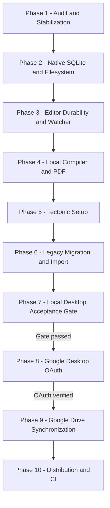

# TeXForge Implementation Plan V3 (Desktop-First)

This document details the architectural layout, database schemas, and execution phases for converting **TeXForge** into an installable desktop application powered by **Tauri 2** and **Rust**.

## 0. External Technical Baseline

The implementation choices in this plan are grounded in the following current primary references:

* **Tauri 2 capabilities and permissions**: [Tauri capabilities](https://v2.tauri.app/security/capabilities/) and [Tauri sidecars](https://v2.tauri.app/develop/sidecar/).
* **Google OAuth for desktop apps**: [OAuth 2.0 for iOS & Desktop Apps](https://developers.google.com/identity/protocols/oauth2/native-app).
* **Google Drive API synchronization**: [Drive scopes](https://developers.google.com/workspace/drive/api/guides/api-specific-auth), [Drive changes](https://developers.google.com/workspace/drive/api/guides/manage-changes), and [Drive appProperties](https://developers.google.com/workspace/drive/api/guides/properties).
* **SQLite durability and migrations**: [SQLite Online Backup API](https://www.sqlite.org/backup.html), [WAL mode](https://www.sqlite.org/wal.html), and [SQLite PRAGMA reference](https://www.sqlite.org/pragma.html).
* **PDF.js offline rendering**: [PDF.js getting started](https://mozilla.github.io/pdf.js/getting_started/).
* **Tectonic engine model**: [Tectonic documentation](https://tectonic-typesetting.github.io/book/latest/index.html).

These links are planning references, not runtime dependencies. The packaged app must still pass the Phase 7 offline acceptance gate with networking disabled.

---

## 1. Directory Structure

```text
TeXForge/
├── src-tauri/                      # Tauri Rust Backend
│   ├── Cargo.toml                  # Rust dependencies
│   ├── tauri.conf.json             # Tauri configuration & capabilities
│   ├── capabilities/
│   │   └── default.json             # Minimal Tauri 2 capability allowlist
│   └── src/
│       ├── main.rs                 # Application entrypoint & command registration
│       ├── db.rs                   # Dedicated SQLite service thread and owned rusqlite connection
│       ├── db/
│       │   ├── migrations.rs       # SQLite schema migrations (numbered, applied transactionally)
│       │   ├── models.rs           # SQLite metadata Rust structs
│       │   └── importer.rs         # Rust-owned ZIP validation and project extraction
│       ├── fs_auth.rs              # Path authorization & validation algorithms
│       ├── fs_commands.rs          # File operation commands (create, write, rename, etc.)
│       ├── compiler.rs             # Compiler spawner service (tokio::process)
│       ├── process_control.rs      # Process group / Job Object tree cancellation
│       ├── watcher.rs              # notify-based directory watcher with loop prevention
│       ├── tectonic.rs             # Tectonic compact installer & downloader
│       ├── oauth.rs                # Phase 8: Loopback OAuth 2.0 & Keychain services (Planned)
│       ├── drive.rs                # Phase 9: Google Drive API Client (Planned)
│       ├── sync.rs                 # Phase 9: Bidirectional Sync Engine (Planned)
│       ├── commands.rs             # Frontend IPC command endpoints
│       └── errors.rs               # Backend error handling and mapping
├── src/                            # React Frontend (WebView)
│   ├── main.tsx
│   ├── App.tsx                     # HashRouter setup (works without web server)
│   ├── index.css                   # Tailwind styling
│   ├── types/
│   │   └── index.ts                # TypeScript strict interface definitions
│   ├── state/
│   │   ├── store.ts                # Zustand store (autosave buffers & UI states)
│   │   └── migrationUi.ts          # UI component for selecting and importing legacy ZIPs
│   ├── components/
│   │   ├── Dashboard.tsx           # Projects dashboard layout
│   │   ├── Layout.tsx              # Resizable workspace panels
│   │   ├── Header.tsx              # Project toolbar controls
│   │   └── SettingsModal.tsx       # Global and project settings modal
│   └── features/
│       ├── drive/                  # DriveProvider TypeScript adapter (calls Tauri commands)
│       ├── compiler/               # Compiler status & stream logs panel
│       ├── editor/                 # Monaco integration, tabs, & editor save pipeline
│       └── pdfViewer/              # PDF.js virtualized offline viewer
└── package.json                    # Frontend dependencies & npm scripts
```

---

## 2. Core Subsystems

### 2.1 Rust-Owned Drive Integration (Phases 8 & 9)
* **Auth & Tokens**: Access tokens remain exclusively in Rust memory. Refresh tokens are stored in the OS Keychain (Keychain Services on macOS, Credential Manager on Windows, Secret Service on Linux) via the `keyring` crate. They are never written to disk, SQLite, browser storage, or console logs.
* **Network & API**: React never interacts with the Google Drive API directly. TypeScript invokes typed Tauri commands. All token renewals, Drive HTTP commands, sync retry backing-off, and changes parsing run in Rust.

### 2.2 Tauri 2 Capabilities & Permissions
* **Minimal Scope**: Do not use `tauri = { version = "2.0", features = ["all"] }`.
* **Explicit Capability File**: Define desktop permissions in `src-tauri/capabilities/default.json` and reference only the intended capability identifier from `tauri.conf.json`. Do not rely on broad implicit capability loading.
* **No Frontend Filesystem Plugin Surface**: React does not use Tauri's filesystem plugin for project files. Project file operations go through typed Rust commands that perform root authorization, canonicalization, symlink rejection, and operation-specific validation.
* **No Arbitrary Frontend Shell Execution**: React never imports or calls `@tauri-apps/plugin-shell`, and the frontend cannot execute commands or select arbitrary binaries. Local compiler execution is Rust-owned through `tokio::process::Command` with a strict executable and argument allowlist.
  * The Rust backend intentionally executes validated compiler binaries.
  * React cannot choose arbitrary executables.
  * React cannot supply unrestricted command-line arguments.
  * Executable paths come from compiler detection, trusted settings, or bundled sidecar configuration.
  * Compiler arguments are assembled and validated in Rust.
  * Shell invocation is avoided where direct process execution is possible (e.g. running subprocesses without `sh` or `cmd.exe`).
* **Tectonic Sidecar Exception**: If Tauri's sidecar mechanism is used to bundle Tectonic, any `tauri-plugin-shell` permission is limited to the exact sidecar name and exact validated argument pattern needed for that binary. No generic `args: true`, no frontend `Command.sidecar(...)`, and no shell permission for user-selected executables are allowed. Prefer direct Rust process spawning for ordinary system TeX tools.
* **Dialog & Opener**: Use `tauri-plugin-dialog` to pick directories, and `tauri-plugin-opener` to reveal project folders in Finder/Explorer or open default external URLs.
* **Sandbox Verification**: Every custom Rust command accepting filesystem path parameters enforces registered project-root checks, canonicalizes paths, and rejects directory traversal.

### 2.3 SQLite Concurrency & Graceful Shutdown Model
* **Dedicated SQLite Service Thread**: We use one writer-owned `rusqlite::Connection` encapsulated inside a dedicated background service thread. Requests are sent to it through a typed, bounded `tokio::sync::mpsc` channel.
* **Channel Details**:
  * **Database Request Enum**: All interactions are defined as a typed database request `enum` describing operations.
  * **Bounded Request Channel**: The bounded `tokio::sync::mpsc` channel acts as the request queue.
  * **Per-Request Response Channel**: Each request carries a `oneshot::Sender` for returning transaction results or database error types.
  * **Transaction Ownership**: Database transactions execute entirely inside the database thread.
  * **Graceful Shutdown**: When database shutdown is initiated, the channel is closed to prevent new requests from being queued. The service thread flushes all transaction write queues and pending WAL changes, then sends a shutdown acknowledgement.
  * **No Abandonment**: The service thread is not abandoned while WAL changes are pending.
  * **Destructive Migrations**: Rather than copying active database files blindly, the service uses SQLite's native backup API to duplicate database files before applying schema changes.
  * **WAL Discipline**: The database lives in app data on the local machine, not in user project folders or Drive-synchronized folders. Shutdown and destructive migration flows run an explicit checkpoint or verified backup step through SQLite APIs; they never copy only the main database file while ignoring live `-wal`/`-shm` state.

### 2.4 Filesystem Authorization & Folder Selection
React is never permitted to pass absolute host path strings directly to filesystem commands.

#### Opaque Trusted Selection Tokens
* Path selection dialogs are initiated exclusively through Rust-owned Tauri commands.
* Rust validates the selected parent directory, archive, or destination path.
* Rust stores the validated path in memory and generates an opaque, single-purpose selection token (an ephemeral UUID) associated with it.
* React receives only the selection token and a sanitized display label (e.g. selected directory name or abbreviated user-facing location).
* React never sends display labels or display paths back to Rust as authorization. Subsequent commands pass the selection token instead of an unrestricted host path.
* Selection tokens are: single-purpose, single-use, session-bound, short-timeout, and consumed immediately after successful or failed terminal use.
* If a path is displayed in the UI for usability, it is presentation-only, and changing the displayed string grants no access; Rust resolves only the opaque token.
* This policy applies to user-selected external filesystem locations, including: new-project parent selection, external-folder registration, import archive selection, export destination selection, and trusted compiler executable selection (if supported). Opening or revealing an already registered project does not require a selection token; instead, the frontend submits the `project_uuid` or `file_uuid`, and the Rust backend resolves the authoritative registered path from the SQLite database.
* For new project creation, Rust opens a trusted native parent-directory chooser, proposing the platform Documents directory as the initially suggested/default directory. The selected parent is authorized through an opaque single-use token, and the frontend never submits an unrestricted absolute path.

#### Path Verification Sequence
For every relative path string requested within a project folder, the Rust backend executes these steps:
1. Reject absolute path strings.
2. Reject empty or malformed path segments.
3. Lexically normalize the relative path.
4. Reject any parent traversal component (`..`).
5. Resolve the registered project root folder from SQLite.
6. Canonicalize the project root folder.
7. Find the nearest existing ancestor directory of the requested target path.
8. Canonicalize that ancestor directory.
9. Verify that the canonicalized ancestor remains strictly inside the registered project root folder.
10. Reject symbolic links by default.
11. Construct the final target path.
12. Execute the filesystem operation.
13. Revalidate the resulting path after creation or renaming.

### 2.5 Desktop Import Security & Canonical Export Format
* **Canonical Export Format**: The canonical export/import format is strictly `<project-name>.texforge.zip`.
  * The archive contains a `.texforge.json` manifest, all project source files, legitimate user-provided binary assets (raster and vector images, fonts, user-provided PDFs), directory hierarchy, checksums, schema version, project UUID, project name, main document path, file UUIDs, and text encoding metadata. A PDF file is included in the ZIP only when it is a user-owned source asset (e.g. background graphics), not when it is the generated compiler output.
  * The manifest JSON resides inside the ZIP, not as a standalone export. The manifest maps the project's settings (compiler engine, compile timeout, and main document UUID/path) to and from the SQLite `project_settings` table. A JSON-only diagnostic export may exist only for metadata backup or diagnostics, but is never described as a complete project migration format.
* **Import**: ZIP validation, decompression, and file extraction must occur strictly in Rust (`importer.rs`) using the opaque token selection flow:
  1. React invokes `select_import_archive`.
  2. Rust opens the native file dialog, validates the selected ZIP metadata, and returns an opaque import token.
  3. React invokes `import_project_archive(import_token, destination_token)`.
  4. Rust resolves tokens, validates compressed size (max 50MB), uncompressed size (max 200MB), file count (max 1000), path traversals, checksums, and decompresses files atomically.
  5. Register in SQLite only after verification. Delete temporary folders on failure.
* **Archive Test Cases (Aligned with Exclusion Policy)**:
  * **User Binary Assets**: Importing project archives containing legitimate user-provided assets (e.g., `.png`, `.jpg`, `.pdf` graphics files, fonts like `.otf`, `.ttf`).
  * **Empty Directories**: Clean handling of folders with no files inside them.
  * **Unicode Filenames**: Handling of filenames containing non-ASCII characters.
  * **Duplicate Normalized Paths**: Rejecting files that resolve to the same normalized relative path.
  * **Oversized Archives**: Rejecting archives exceeding the 50MB compressed/200MB uncompressed boundaries.
  * **Checksum Mismatch**: Rejecting archives where file hashes do not match the manifest checksums.
  * **Path Traversal**: Rejecting archives containing files with `..` in their path segments.
  * **Corrupted ZIP Central Directory**: Handling of malformed, partial, or corrupted ZIP structures.
  * **Unsupported Schema Version**: Rejecting archives that advertise a manifest schema version incompatible with the current client.
  * **Compiler Outputs Exclusion**: Verifying that generated compiler files (like `.aux`, `.log`, `.out`, `.toc`, SyncTeX outputs, or build output PDFs) are **deleted/excluded** by default from exports, unless explicitly marked as a user-owned source asset (e.g. a manually imported background PDF).

### 2.6 Editor Save Pipeline & Recovery Snapshot Lifecycle
* **Editor Buffer Dirty State**: Maintained in Monaco/Zustand and local crash-recovery storage. This represents whether the current editor content differs from the latest confirmed disk write. States include: `clean`, `modified-in-editor`, `saving`, `save-error`, `externally-modified`, and `conflict`.
* **Crash-Recovery Snapshot Storage**: Recovery snapshots are **never** stored inside the project source directory to prevent interference with compile tasks and watchers. They are written atomically to `<app-data-dir>/recovery/<project_uuid>/<file_uuid>.snapshot`. Restrictive filesystem permissions are applied where supported.
* **Recovery Lifecycle**:
  1. **Restore**:
     * User selects restore.
     * Snapshot content is loaded into the Monaco buffer.
     * Buffer remains marked as recovered and dirty.
     * User confirms or autosave attempts a durable project-file write.
     * Rust atomically writes the project file.
     * Rust confirms the disk write and resulting hash.
     * Only after confirmation is the recovery snapshot deleted.
  2. **Compare**:
     * Retain the snapshot in `<app-data-dir>/` until the user resolves the comparison and saves or explicitly discards it.
  3. **Discard**:
     * Require explicit user confirmation.
     * Delete the snapshot only after confirmation.
  4. **Retention Policy**:
     * Do not auto-delete recent unresolved snapshots on startup.
     * Allow user-visible cleanup of snapshots.
     * Delete only snapshots older than a documented threshold (e.g., 7 days) and not associated with an unresolved recovery session.
     * Record cleanup errors without blocking application startup.
* **Drive Synchronization Dirty State vs. Editor Dirty State**:
  * **Editor Buffer Dirty State** concerns unsaved text content in Monaco/Zustand memory.
  * **Drive Synchronization Dirty State** (`sync_dirty`) is managed strictly within SQLite via the `sync_dirty` column on the `files` table and concerns files already saved to disk but not yet synchronized with Google Drive.
  * The two states are distinct and must never be treated as equivalent.
  * **Local-only projects** keep `sync_dirty = 0` on disk save, do not create a synchronization queue item, and do not enter remote synchronization statuses.
  * **Synchronized projects (Phase 9)** set `sync_dirty = 1` on disk save, change file sync status to 'queued', and enqueue a Drive synchronization task.

* **Partial-Success Semantics (Filesystem vs SQLite)**:
  Because the local filesystem is the authoritative source for project content, write operations can occasionally result in a state where the disk write succeeds but the SQLite metadata update fails.
  * **File Save Flow**:
    * Rust returns a typed result distinguishing three outcomes:
      1. `failed-before-durable-write`: The disk write failed; no changes were made to the file.
      2. `saved-and-indexed`: Both the file was written to disk and SQLite metadata was updated.
      3. `saved-needs-reconciliation`: The file was durably written to disk, but the SQLite metadata update failed.
    * If the atomic disk replacement succeeded, the editor content is durable. The application schedules a reconciliation run and shows a metadata warning badge, rather than reporting that the disk save failed.
    * The recovery snapshot is deleted only after the durable disk write is confirmed, regardless of the SQLite indexing outcome.
  * **Create, Import, and Register Flows**:
    * If database registration fails after application-created temporary or final directories have been created, a compensating cleanup is initiated to remove the created directories.
    * Compensation must **never** delete a pre-existing user-owned external folder.
    * If a safe cleanup is impossible, the application leaves a recoverable, explicitly reported error state.

### 2.7 Filesystem-SQLite Reconciliation & Watcher
Because filesystem watchers do not capture events while the application is closed and may occasionally drop events due to buffer overflows, we implement a `reconcile_project(project_uuid)` command.

#### Project Operations Flows
The app distinguishes clearly between project creation, project opening, and external folder registration:
* **New Project Flow**:
  1. Select trusted parent.
  2. Create project directory.
  3. Create template files.
  4. Register all initial records transactionally.
  5. Perform lightweight validation.
  6. Start watcher.
* **Existing Registered Project Flow**:
  1. Resolve metadata.
  2. Validate root.
  3. Reconcile filesystem and SQLite.
  4. Commit reconciliation transactionally.
  5. Load initial file tree and requested files.
  6. Start watcher.
* **Newly Registered External Folder Flow**:
  1. Select trusted existing directory.
  2. Validate root and reject symbolic links.
  3. Create project registry record in a transaction.
  4. Perform full initial reconciliation.
  5. Select or detect the main document.
  6. Load tree.
  7. Start watcher.

* **Watcher Startup Failure**:
  * Keep the project open.
  * Show a visible degraded-state warning.
  * Allow manual reconciliation.
  * Do not pretend external modifications are being monitored.
* **Tombstone Semantics**:
  * **Local-only projects (Phase 2)**: When reconciliation confirms a local file is missing, its SQLite index record is removed transactionally. No tombstones are retained. Unresolved recovery or conflict data are preserved separately.
  * **Synchronized projects (Phase 9)**: When a synchronized file is deleted locally, a tombstone is recorded in the SQLite database, and a remote delete/trash operation is enqueued. The tombstone is deleted only after remote confirmation. When a file is deleted remotely, local deletion is applied unless local content has changed, triggering conflict rules. The `tombstone` field in SQLite is named and documented specifically for remote deletion synchronization, not generic local missing-file state.

### 2.8 Excluded and Generated Files Policy
The application maintains a shared internal exclusion matcher. The filesystem scanner, reconciliation service, watcher normalizer, project file tree, ZIP exporter, and Drive sync engine must exclude:
* Application recovery snapshots (`<app-data-dir>/recovery/*`)
* Compiler build directories and PDF build caches
* SQLite database files and corresponding WAL/SHM files
* Application temporary files and atomic-write temporary files
* Synchronization snapshots and conflict working copies
* Tectonic resource bundles and application logs
* Platform-specific temporary files (e.g. `.DS_Store`)

Compiler build output lives outside the project source root, for example under `<app-data-dir>/build/<project_uuid>/<build_id>/`. If compiled files must reside inside the project for compatibility, the build folder must be explicitly configured, excluded from watcher user events, excluded from reconciliation as source files, excluded from the normal file tree by default, excluded from Drive source synchronization, and removable through a "Clean build files" action. Unrestricted user-provided glob patterns are rejected for security-sensitive path validation.

### 2.9 External Fallback Compiler Policy
* **Fallback Service**: TeXForge includes an optional external fallback compilation path to `texlive.net`.
* **Policy Settings**:
  * **Disabled by Default**: The fallback is disabled by default in the desktop application configuration.
  * **Not Required**: It is completely optional and never automatically selected after local compiler failures.
  * **Explicit Consent**: Requires explicit user opt-in. A privacy warning is displayed before every upload or according to a clearly stored informed-consent setting.
  * **Privacy Warning Wording**: The warning must explicitly explain that the selected main document contents are transmitted to a third-party public service. If a future implementation ever supports multiple files, the consent dialog must enumerate the exact files to be transmitted for that specific request; it must not use broad wording such as "project files" unless all files are indeed sent.
  * **File Limits**: It states exactly which files will be transmitted, allowing cancellation before upload.
  * **Exclusions**: It never transmits recovery snapshots, application metadata, tokens, or excluded internal files.
  * **Global Disable**: It is completely unavailable if the user disables external compilation globally in Settings.
  * **Acceptance Path Exclusion**: It is not part of the Phase 7 offline acceptance path (local compilations must work entirely offline).
  * **Visual Indicator**: A visible external-service indicator is always displayed in the editor UI while the fallback is selected.

### 2.10 Local Compiler Requirements
TeXForge implements native compiler detection and build management in the Rust backend:
* **Supported Compilers**: Detection for `latexmk` (preferred compilation manager), `pdflatex`, `xelatex`, `lualatex`, and the configured Tectonic sidecar.
* **Auto-Detection Paths**: The backend checks standard installation directories without receiving arbitrary compiler paths from React:
  * Effective GUI-process environment `PATH`.
  * Common TeX Live installation locations.
  * Common MiKTeX installation locations.
  * macOS `/Library/TeX/texbin/` directory.
  * Standard Windows Registry and installation directories.
  * A user-configured, trusted executable path validated by Rust.
* **Prohibit Shell Escape**:
  * Shell escape is **completely disabled** throughout Phases 1–7.
  * The Rust backend never passes `-shell-escape` to compiler processes, and instead passes the engine's explicit no-shell-escape option where supported.
  * The application does not provide a UI opt-in for shell escape during the local milestone, nor does it permit project metadata or "trusted project" settings to enable shell escape.
  * All compiler arguments remain Rust-owned and allowlisted.
  * Any future shell escape support is classified as out of scope for the current roadmap and would require a separate threat model, sandboxing, explicit per-project authorization with warnings, and platform-specific testing.
* **Compilation execution**:
  * Spawns non-blocking tokio processes.
  * Enforces a dedicated build directory outside the project source root (under `<app-data-dir>/build/<project_uuid>/<build_id>/`) to isolate intermediate files and avoid watcher loops.
  * Supports full multi-file projects (e.g., included `.tex` chapters, `.bib` files, `.sty`/`.cls` style assets, and user images).
  * Runs in non-interactive mode (`-interaction=nonstopmode` or the selected engine's equivalent).
  * Requests file-and-line error output using `-file-line-error` for compatible TeX engines or the selected engine's equivalent.
  * Generates SyncTeX mapping when supported.
  * Real-time stdout/stderr streaming with sequence numbers.
  * Preserves raw log outputs and compiles-from-scratch actions.
  * Parses log warnings/errors to click-navigate to file-and-line.
  * Falls back safely when log lines are malformed, truncated or do not contain a line number.
  * Stale-PDF warnings and stable compilation ID lifecycles.
  * Uses a configurable compilation timeout. Timeout terminates the complete process tree and emits exactly one `timed-out` terminal event for the matching `compilation_id`.

### 2.11 PDF.js Viewer Requirements
Offline PDF rendering is achieved using a fully offline, virtualized PDF.js component:
* **Offline worker**: PDF.js worker script is bundled locally as a frontend asset, ensuring zero external CDN dependencies.
* **Loading & Navigation**: Loads compilation output from `<app-cache-dir>/pdf/<project_uuid>/`. Provides page virtualization (rendering pages only as they enter the viewport to manage memory), page navigation toolbar, page step controls, and page indicator.
* **Visual Actions**: Zoom settings (percentage zoom, fit width, fit page), rotation, fullscreen view, and keyboard navigation.
* **System Actions**: Print PDF, save/copy PDF, and open PDF externally in the system default PDF viewer.
* **Recompilation Preservation**: Preserves current page number, zoom factor, and scroll position across successful compiles.
* **Failed Compiles**: Displays the last valid PDF from cache, with a visible stale PDF warning badge.
* **SyncTeX**: Displays SyncTeX cursor/click buttons only if valid SyncTeX output exists.
* **No Decorative Placeholders**: All PDF actions must operate functionally, not as placeholders.

### 2.12 Desktop Routing and Dashboard
* **Desktop Routing**: Uses React `HashRouter` to enable client-side routing in a packaged Tauri environment without a local web server.
* **App Views**: Project Dashboard, Project Workspace, Settings Modal, Tectonic Setup Panel, Legacy Migration/Import UI, Recovery Snapshots List, and Sync Conflicts Resolver.
* **Dashboard Functions (Local Milestone)**:
  * List registered projects with metadata: name, local path, last modified time, and compiler status.
  * Search, sort, and display recent projects.
  * Create new projects from templates.
  * Register an existing project folder.
  * Import/Export `.texforge.zip` canonical packages.
  * Rename, duplicate, and remove project registrations.
  * **Delete Confirmation**: Deleting a project from disk is separate from removing its registry record and requires a separate explicit user confirmation dialog to prevent data loss.
  * **Project Settings and Main-Document Deletion/Rename Cascade Behavior**: When a project registration is deleted, its corresponding `project_settings` row is automatically removed via `ON DELETE CASCADE`. If a file that was set as the main document is deleted from the `files` table, only `main_file_uuid` is set to `NULL`; `project_uuid` is never part of an `ON DELETE SET NULL` child key. Same-project and file-kind rules are enforced by triggers and Rust validation.
  * Reveal project directories in system file explorers (Finder/Explorer).
  * Project-specific compiler settings.
* **Dashboard Functions (Phase 9 Future)**:
  * Display synchronization status, associated Drive accounts, and conflicts warnings.
  * Drive-only project discovery summary listings (enabling download of remote projects).

---

## 3. SQLite Database Schema & Migration Strategy

SQLite schema migrations are split across implementation phases.

### 3.1 Migration Strategy by Phase
* **Phase 2 Base Schema**: Create only local-desktop requirements: `projects`, `files`, `settings`, `schema_migrations`.
  * **Dormant Synchronization Columns**: Nullable dormant columns are created in Phase 2 base schema, including `base_hash`, `remote_md5_checksum`, `remote_version`, `remote_modified_time`, `last_synced_at`, `sync_dirty`, `tombstone`, `drive_file_id`, `drive_parent_folder_id`, and `last_sync_error`.
  * **Strict Phase 2 CHECK Constraints**: Database-level constraints strictly enforce local-only states in Phase 2. `storage_mode` is limited to `'local'`, `sync_status` is limited to `'local-only'`, `sync_dirty` must be `0`, and `tombstone` must be `0`. Dormant columns must be `NULL`.
* **Phase 8 Migration (Planned)**: Create `drive_accounts` table and non-secret account metadata. Transactionally migrate the `projects` table using SQLite's rebuild pattern (copy data to a temporary table, drop, recreate with new constraints, and copy back) to add and enforce a foreign key referencing `drive_accounts`.
* **Phase 9 Migration (Planned)**: Phase 9 transactionally rebuilds the `projects` and `files` tables to expand constraints (permitting `synced` storage modes and remote sync statuses), activates the dormant remote metadata fields, and creates the synchronization queue, conflicts tables, Drive indexes, and runtime services.

### 3.2 Migration Tracking Table
A `schema_migrations` table is created in the Phase 2 base schema to track version applications:
```sql
CREATE TABLE IF NOT EXISTS schema_migrations (
    version INTEGER PRIMARY KEY,
    name TEXT NOT NULL,
    applied_at INTEGER NOT NULL,
    application_version TEXT NOT NULL
);
```
* **Migration Rollback & Recovery**: In case of migration failure, the database rolls back transactionally. If applying the schema fails, the backup copy created by the SQLite Backup API is restored.

### 3.3 Phase 2 Base Schema Tables
```sql
-- Projects Table (Local-Only Constraints in Phase 2)
CREATE TABLE IF NOT EXISTS projects (
    uuid TEXT PRIMARY KEY,
    name TEXT NOT NULL,
    local_path TEXT UNIQUE NOT NULL,
    storage_mode TEXT NOT NULL DEFAULT 'local' CHECK(storage_mode = 'local'),
    sync_status TEXT NOT NULL DEFAULT 'local-only' CHECK(sync_status = 'local-only'),
    drive_account_id TEXT,                                -- Dormant in Phase 2
    drive_root_folder_id TEXT,                            -- Dormant in Phase 2
    drive_project_folder_id TEXT,                         -- Dormant in Phase 2
    drive_manifest_file_id TEXT,                          -- Dormant in Phase 2
    last_successful_sync_at INTEGER,                      -- Dormant in Phase 2
    created_at INTEGER NOT NULL,
    updated_at INTEGER NOT NULL,
    CONSTRAINT chk_drive_dormant CHECK (
        drive_account_id IS NULL
        AND drive_root_folder_id IS NULL
        AND drive_project_folder_id IS NULL
        AND drive_manifest_file_id IS NULL
        AND last_successful_sync_at IS NULL
    )
);

-- Files Table (Local-Only Constraints in Phase 2)
CREATE TABLE IF NOT EXISTS files (
    uuid TEXT PRIMARY KEY,
    project_uuid TEXT NOT NULL,
    parent_uuid TEXT,
    relative_path TEXT NOT NULL,
    file_name TEXT NOT NULL,
    kind TEXT NOT NULL CHECK(kind IN ('file', 'folder')),
    mime_type TEXT NOT NULL,                              -- 'inode/directory' for folders
    size_bytes INTEGER NOT NULL DEFAULT 0,
    base_hash TEXT,                                       -- Dormant in Phase 2
    local_hash TEXT,
    remote_md5_checksum TEXT,                             -- Dormant in Phase 2
    remote_version INTEGER,                               -- Dormant in Phase 2
    remote_modified_time TEXT,                            -- Dormant in Phase 2
    last_synced_at INTEGER,                               -- Dormant in Phase 2
    sync_status TEXT NOT NULL DEFAULT 'local-only' CHECK(sync_status = 'local-only'),
    sync_dirty INTEGER NOT NULL DEFAULT 0 CHECK(sync_dirty = 0),
    tombstone INTEGER NOT NULL DEFAULT 0 CHECK(tombstone = 0),
    drive_file_id TEXT,                                   -- Dormant in Phase 2
    drive_parent_folder_id TEXT,                          -- Dormant in Phase 2
    last_sync_error TEXT,                                 -- Dormant in Phase 2
    created_at INTEGER NOT NULL,
    updated_at INTEGER NOT NULL,
    UNIQUE(project_uuid, relative_path),
    UNIQUE(project_uuid, uuid),
    FOREIGN KEY(project_uuid) REFERENCES projects(uuid) ON DELETE CASCADE,
    FOREIGN KEY(project_uuid, parent_uuid) REFERENCES files(project_uuid, uuid) ON DELETE CASCADE,
    CONSTRAINT chk_drive_dormant CHECK (
        base_hash IS NULL
        AND remote_md5_checksum IS NULL
        AND remote_version IS NULL
        AND remote_modified_time IS NULL
        AND last_synced_at IS NULL
        AND drive_file_id IS NULL
        AND drive_parent_folder_id IS NULL
        AND last_sync_error IS NULL
    )
);

-- Settings Table
CREATE TABLE IF NOT EXISTS settings (
    key TEXT PRIMARY KEY,
    value TEXT NOT NULL
);

-- Project Settings Table (Phase 2 Normalized Settings)
CREATE TABLE IF NOT EXISTS project_settings (
    project_uuid TEXT PRIMARY KEY,
    main_file_uuid TEXT,
    compiler_engine TEXT NOT NULL DEFAULT 'latexmk'
        CHECK(compiler_engine IN ('auto', 'latexmk', 'pdflatex', 'xelatex', 'lualatex', 'tectonic')),
    compile_timeout_seconds INTEGER NOT NULL DEFAULT 30
        CHECK(compile_timeout_seconds > 0 AND compile_timeout_seconds <= 300),
    created_at INTEGER NOT NULL,
    updated_at INTEGER NOT NULL,
    FOREIGN KEY(project_uuid) REFERENCES projects(uuid) ON DELETE CASCADE,
    FOREIGN KEY(main_file_uuid) REFERENCES files(uuid) ON DELETE SET NULL
);

-- Triggers for project_settings main_file_uuid validation
CREATE TRIGGER IF NOT EXISTS trg_project_settings_main_file_kind_insert
BEFORE INSERT ON project_settings
FOR EACH ROW
WHEN NEW.main_file_uuid IS NOT NULL
BEGIN
    SELECT CASE
        WHEN NOT EXISTS (
            SELECT 1 FROM files
            WHERE uuid = NEW.main_file_uuid
              AND project_uuid = NEW.project_uuid
              AND kind = 'file'
        )
        THEN RAISE(ABORT, 'main_file_uuid must reference a file, not a folder')
    END;
END;

CREATE TRIGGER IF NOT EXISTS trg_project_settings_main_file_kind_update
BEFORE UPDATE ON project_settings
FOR EACH ROW
WHEN NEW.main_file_uuid IS NOT NULL
BEGIN
    SELECT CASE
        WHEN NOT EXISTS (
            SELECT 1 FROM files
            WHERE uuid = NEW.main_file_uuid
              AND project_uuid = NEW.project_uuid
              AND kind = 'file'
        )
        THEN RAISE(ABORT, 'main_file_uuid must reference a file, not a folder')
    END;
END;

-- Triggers for files hierarchy validation
CREATE TRIGGER IF NOT EXISTS trg_files_self_parenting_insert
BEFORE INSERT ON files
FOR EACH ROW
WHEN NEW.parent_uuid IS NOT NULL AND NEW.parent_uuid = NEW.uuid
BEGIN
    SELECT RAISE(ABORT, 'A file or folder cannot parent itself');
END;

CREATE TRIGGER IF NOT EXISTS trg_files_self_parenting_update
BEFORE UPDATE ON files
FOR EACH ROW
WHEN NEW.parent_uuid IS NOT NULL AND NEW.parent_uuid = NEW.uuid
BEGIN
    SELECT RAISE(ABORT, 'A file or folder cannot parent itself');
END;

CREATE TRIGGER IF NOT EXISTS trg_files_parent_kind_insert
BEFORE INSERT ON files
FOR EACH ROW
WHEN NEW.parent_uuid IS NOT NULL
BEGIN
    SELECT CASE
        WHEN (SELECT kind FROM files WHERE uuid = NEW.parent_uuid AND project_uuid = NEW.project_uuid) != 'folder'
        THEN RAISE(ABORT, 'parent_uuid must reference a folder')
    END;
END;

CREATE TRIGGER IF NOT EXISTS trg_files_parent_kind_update
BEFORE UPDATE ON files
FOR EACH ROW
WHEN NEW.parent_uuid IS NOT NULL
BEGIN
    SELECT CASE
        WHEN (SELECT kind FROM files WHERE uuid = NEW.parent_uuid AND project_uuid = NEW.project_uuid) != 'folder'
        THEN RAISE(ABORT, 'parent_uuid must reference a folder')
    END;
END;

-- Database Indices
CREATE INDEX IF NOT EXISTS idx_files_project ON files(project_uuid);
CREATE INDEX IF NOT EXISTS idx_files_parent ON files(project_uuid, parent_uuid);
```

#### Hierarchy Integrity Rules

Ordinary SQLite CHECK constraints cannot validate fields across different rows or prevent recursive relationship cycles. Therefore, hierarchy integrity is enforced through a multi-layered validation design:

1. **Same-Project Constraint**: Enforced by the compound foreign key `FOREIGN KEY(project_uuid, parent_uuid) REFERENCES files(project_uuid, uuid) ON DELETE CASCADE`.
2. **Self-Parenting Prevention**: Prevented by database triggers and Rust validation rejecting inserts/updates where `parent_uuid = uuid`.
3. **Folder Parent Validation**: Database triggers and Rust validation verify that the row referenced by `parent_uuid` has `kind = 'folder'`.
4. **Cycle Rejection**: Prevented through recursive validation (using recursive CTEs or depth-first search in Rust) to ensure no directory cycles can be formed.
5. **Main Document Integrity**: `main_file_uuid` uses a single-column foreign key to `files(uuid) ON DELETE SET NULL`; triggers and Rust validation enforce same-project ownership and `kind = 'file'`. This avoids invalid composite `ON DELETE SET NULL` behavior that would otherwise attempt to null `project_uuid`.
6. **Rust Pre-Mutation Checks**: The Rust command handler performs all of the above validations before initiating database modifications.
7. **Automated Testing**: Verification includes tests asserting the rejection of cross-project parents, self-parenting, file-as-parent relationships, indirect cycles, invalid main-document folders, and deleted-main-document nulling.

### 3.4 Phase 8 Schema Migration (Planned - Target Schema)
The Phase 8 migration is applied transactionally when native Google OAuth is integrated:
```sql
-- Drive Accounts Table
CREATE TABLE IF NOT EXISTS drive_accounts (
    account_id TEXT PRIMARY KEY,
    email TEXT NOT NULL,
    display_name TEXT,
    start_page_token TEXT,
    last_checked_at INTEGER,
    created_at INTEGER NOT NULL,
    updated_at INTEGER NOT NULL
);
```
* **Security constraint**: Secret credentials (access tokens, refresh tokens, PKCE verifiers, client secrets, auth codes) are **never** stored in the database. They reside in Keychain or memory.
* **Migration**: The `projects` table is transactionally rebuilt to add and enforce a foreign key constraint referencing `drive_accounts`:

#### Phase 8 `projects` Table Rebuild Procedure

The existing `projects` table cannot be modified by running
`CREATE TABLE IF NOT EXISTS projects`, because the table already exists.
Phase 8 therefore uses SQLite's generalized table-rebuild procedure.

The database service thread remains the sole owner of the SQLite connection. The migration must execute through this service and follow this explicit sequence:

1. Prevent new database requests from entering the service channel.
2. Drain or safely pause queued requests.
3. Create a verified backup of the database file through the SQLite Backup API.
4. Execute `PRAGMA foreign_keys = OFF;` to temporarily disable foreign key checking (this must be executed on the connection *before* opening the migration transaction, as changing it inside a transaction has no effect).
5. Begin an immediate migration transaction (`BEGIN IMMEDIATE TRANSACTION;`).
6. Create `drive_accounts` within the migration transaction if it does not already exist, and verify its expected schema before creating `projects_new`.
7. Create `projects_new` using the Phase 8 schema.
8. Copy all rows from `projects` to `projects_new`.
9. Verify copied row counts and required non-null invariants.
10. Drop the old `projects` table.
11. Rename `projects_new` to `projects`.
12. Recreate all affected indexes and triggers.
13. Commit the migration transaction.
14. Re-enable foreign key constraints by executing `PRAGMA foreign_keys = ON;` after committing the transaction.
15. Execute `PRAGMA foreign_key_check;` to verify database-wide foreign key integrity.
16. If any step fails before commit, roll back the transaction and invoke the documented database restore procedure (using the Backup API copy) before resuming requests.
Because `files.project_uuid` references `projects.uuid`, the migration must
preserve all project UUID values and validate dependent foreign keys before
normal application work resumes.


```sql
CREATE TABLE projects_new (
    uuid TEXT PRIMARY KEY,
    name TEXT NOT NULL,
    local_path TEXT UNIQUE NOT NULL,
    storage_mode TEXT NOT NULL DEFAULT 'local'
        CHECK(storage_mode = 'local'),
    sync_status TEXT NOT NULL DEFAULT 'local-only'
        CHECK(sync_status = 'local-only'),

    drive_account_id TEXT,

    drive_root_folder_id TEXT,
    drive_project_folder_id TEXT,
    drive_manifest_file_id TEXT,
    last_successful_sync_at INTEGER,

    created_at INTEGER NOT NULL,
    updated_at INTEGER NOT NULL,

    FOREIGN KEY(drive_account_id)
        REFERENCES drive_accounts(account_id)
        ON DELETE SET NULL,

    CONSTRAINT chk_phase8_sync_fields_dormant CHECK (
        drive_root_folder_id IS NULL
        AND drive_project_folder_id IS NULL
        AND drive_manifest_file_id IS NULL
        AND last_successful_sync_at IS NULL
    )
);
```

During Phase 8, only `drive_account_id` may be populated. Connecting an OAuth
account does not activate project synchronization. Drive folder IDs, manifest
IDs and synchronization timestamps remain null until the Phase 9 migration.

### 3.5 Phase 9 Schema Migration (Planned - Target Schema)
Phase 9 expands database CHECK constraints to activate bidirectional synchronization:

```sql
-- Phase 9 Target Projects Rebuilt Table (projects_new)
CREATE TABLE projects_new (
    uuid TEXT PRIMARY KEY,
    name TEXT NOT NULL,
    local_path TEXT UNIQUE NOT NULL,
    storage_mode TEXT NOT NULL DEFAULT 'local'
        CHECK(storage_mode IN ('local', 'synced')),
    sync_status TEXT NOT NULL DEFAULT 'local-only'
        CHECK(sync_status IN ('local-only', 'queued', 'syncing', 'synced', 'offline', 'conflict', 'error')),
    drive_account_id TEXT,
    drive_root_folder_id TEXT,
    drive_project_folder_id TEXT,
    drive_manifest_file_id TEXT,
    last_successful_sync_at INTEGER,
    created_at INTEGER NOT NULL,
    updated_at INTEGER NOT NULL,
    FOREIGN KEY(drive_account_id)
        REFERENCES drive_accounts(account_id)
        ON DELETE SET NULL
);

-- Phase 9 Target Files Rebuilt Table (files_new)
CREATE TABLE files_new (
    uuid TEXT PRIMARY KEY,
    project_uuid TEXT NOT NULL,
    parent_uuid TEXT,
    relative_path TEXT NOT NULL,
    file_name TEXT NOT NULL,
    kind TEXT NOT NULL CHECK(kind IN ('file', 'folder')),
    mime_type TEXT NOT NULL,
    size_bytes INTEGER NOT NULL DEFAULT 0,
    base_hash TEXT,
    local_hash TEXT,
    remote_md5_checksum TEXT,
    remote_version INTEGER,
    remote_modified_time TEXT,
    last_synced_at INTEGER,
    sync_status TEXT NOT NULL DEFAULT 'local-only'
        CHECK(sync_status IN ('local-only', 'queued', 'syncing', 'synced', 'offline', 'conflict', 'error')),
    sync_dirty INTEGER NOT NULL DEFAULT 0 CHECK(sync_dirty IN (0, 1)),
    tombstone INTEGER NOT NULL DEFAULT 0 CHECK(tombstone IN (0, 1)),
    drive_account_id TEXT,                                -- Nullable account binding context
    drive_file_id TEXT,
    drive_parent_folder_id TEXT,
    last_sync_error TEXT,
    created_at INTEGER NOT NULL,
    updated_at INTEGER NOT NULL,
    UNIQUE(project_uuid, relative_path),
    UNIQUE(project_uuid, uuid),
    FOREIGN KEY(project_uuid) REFERENCES projects_new(uuid) ON DELETE CASCADE,
    FOREIGN KEY(project_uuid, parent_uuid) REFERENCES files_new(project_uuid, uuid) ON DELETE CASCADE,
    FOREIGN KEY(drive_account_id) REFERENCES drive_accounts(account_id) ON DELETE SET NULL,
    CONSTRAINT chk_remote_identity_has_account CHECK (
        (drive_file_id IS NULL OR drive_account_id IS NOT NULL)
        AND (drive_parent_folder_id IS NULL OR drive_account_id IS NOT NULL)
    )
);

-- Sync Queue Table
CREATE TABLE IF NOT EXISTS sync_queue (
    id INTEGER PRIMARY KEY AUTOINCREMENT,
    project_uuid TEXT NOT NULL,
    file_uuid TEXT,                                       -- Nullable for project-level operations
    operation_type TEXT NOT NULL CHECK(operation_type IN ('upload', 'download', 'rename', 'move', 'delete', 'create_folder')),
    payload_json TEXT,
    status TEXT NOT NULL CHECK(status IN ('pending', 'running', 'failed')),
    idempotency_key TEXT UNIQUE NOT NULL,
    retry_count INTEGER NOT NULL DEFAULT 0,
    next_retry_at INTEGER NOT NULL,
    last_error TEXT,
    locked_at INTEGER,
    lock_owner TEXT,
    lease_expires_at INTEGER,
    created_at INTEGER NOT NULL,
    updated_at INTEGER NOT NULL,
    FOREIGN KEY(project_uuid) REFERENCES projects(uuid) ON DELETE CASCADE,
    -- Compound foreign key, active only when file_uuid is not null
    FOREIGN KEY(project_uuid, file_uuid) REFERENCES files(project_uuid, uuid) ON DELETE CASCADE,
    CONSTRAINT chk_sync_queue_lease_invariants CHECK (
        (status = 'running' AND lock_owner IS NOT NULL AND locked_at IS NOT NULL AND lease_expires_at IS NOT NULL)
        OR (status IN ('pending', 'failed') AND lock_owner IS NULL AND locked_at IS NULL AND lease_expires_at IS NULL)
    )
);

-- Sync Conflicts Table (Retention-Safe Design)
CREATE TABLE IF NOT EXISTS conflicts (
    conflict_id INTEGER PRIMARY KEY AUTOINCREMENT,
    project_uuid TEXT NOT NULL,
    file_uuid TEXT,                                       -- Nullable live reference
    file_uuid_at_detection TEXT NOT NULL,                -- Immutable NOT NULL historical identity
    relative_path_at_detection TEXT NOT NULL,            -- Immutable NOT NULL path snapshot
    status TEXT NOT NULL CHECK(status IN ('active', 'resolved-locally-pending-sync', 'resolved', 'resolution-sync-error')),
    base_hash TEXT,
    local_hash TEXT,
    remote_hash TEXT,
    base_snapshot_path TEXT,                              -- <app-data-dir>/conflicts/<project_uuid>/<conflict_id>/base
    local_snapshot_path TEXT,                             -- <app-data-dir>/conflicts/<project_uuid>/<conflict_id>/local
    remote_snapshot_path TEXT,                            -- <app-data-dir>/conflicts/<project_uuid>/<conflict_id>/remote
    selected_resolution TEXT CHECK(selected_resolution IN ('keep_local', 'keep_remote', 'merged', 'keep_both')),
    created_at INTEGER NOT NULL,
    updated_at INTEGER NOT NULL,
    resolved_at INTEGER,
    FOREIGN KEY(project_uuid) REFERENCES projects(uuid) ON DELETE CASCADE,
    -- Single-column live reference is set to NULL on source-file deletion while project_uuid remains historical context.
    FOREIGN KEY(file_uuid) REFERENCES files(uuid) ON DELETE SET NULL
);

-- Conflict live-reference same-project validation
CREATE TRIGGER IF NOT EXISTS trg_conflicts_file_same_project_insert
BEFORE INSERT ON conflicts
FOR EACH ROW
WHEN NEW.file_uuid IS NOT NULL
BEGIN
    SELECT CASE
        WHEN NOT EXISTS (
            SELECT 1 FROM files
            WHERE uuid = NEW.file_uuid
              AND project_uuid = NEW.project_uuid
        )
        THEN RAISE(ABORT, 'conflict file_uuid must belong to the same project')
    END;
END;

CREATE TRIGGER IF NOT EXISTS trg_conflicts_file_same_project_update
BEFORE UPDATE OF file_uuid, project_uuid ON conflicts
FOR EACH ROW
WHEN NEW.file_uuid IS NOT NULL
BEGIN
    SELECT CASE
        WHEN NOT EXISTS (
            SELECT 1 FROM files
            WHERE uuid = NEW.file_uuid
              AND project_uuid = NEW.project_uuid
        )
        THEN RAISE(ABORT, 'conflict file_uuid must belong to the same project')
    END;
END;

-- Target Indexes
CREATE INDEX IF NOT EXISTS idx_sync_queue_pending ON sync_queue(status, next_retry_at);
CREATE INDEX IF NOT EXISTS idx_sync_queue_project ON sync_queue(project_uuid);
CREATE INDEX IF NOT EXISTS idx_sync_queue_project_status ON sync_queue(project_uuid, status);
CREATE INDEX IF NOT EXISTS idx_conflicts_active ON conflicts(project_uuid, status);
CREATE INDEX IF NOT EXISTS idx_projects_drive_account ON projects(drive_account_id);
-- Compound project-scoped remote index
CREATE UNIQUE INDEX IF NOT EXISTS idx_files_project_drive_file_id
ON files(project_uuid, drive_file_id)
WHERE drive_file_id IS NOT NULL;
-- Unique index to prevent simultaneous open conflicts for the same file identity
CREATE UNIQUE INDEX IF NOT EXISTS idx_one_open_conflict_per_file
ON conflicts(project_uuid, file_uuid_at_detection)
WHERE status IN (
    'active',
    'resolved-locally-pending-sync',
    'resolution-sync-error'
);
-- Unique index to enforce unambiguous remote-identity binding invariant
CREATE UNIQUE INDEX IF NOT EXISTS idx_files_unique_remote_binding
ON files(drive_account_id, drive_file_id)
WHERE drive_file_id IS NOT NULL;
```

#### Remote Identity Rules

- `file_uuid` is the stable TeXForge logical identity.
- `drive_file_id` is the provider-specific Google Drive identity.
- Drive update, move and delete operations use the Drive account context plus
  `drive_file_id`.
- File names and relative paths are never used as the sole remote identity.
- Drive `appProperties` store the TeXForge project UUID and file UUID.
- `drive_parent_folder_id` is updated whenever a remote item moves.
- `drive_file_id` and `drive_parent_folder_id` remain null before Phase 9.
- `drive_file_id` and `drive_parent_folder_id` require a non-null
  `drive_account_id`; remote identity is never accountless.
- Same-project conflict references are enforced through Rust validation and
  database triggers, not through a composite `ON DELETE SET NULL` foreign key
  that would erase `project_uuid`.
- With the narrow `drive.file` scope, Drive discovery is limited to files
  created by TeXForge or explicitly opened/shared with TeXForge. Arbitrary
  whole-Drive discovery is out of scope unless the user explicitly grants files
  through Google Picker or a future broader-scope verification track is
  designed.

* **Lifecycle Rules**:
  * **Successful Queue Operations**:
    Successfully completed operations are removed transactionally from
    `sync_queue`. A structured, redacted operation-history record may be written
    under `<app-data-dir>/logs/sync/`.

    Operation-history logs must:
    - exclude OAuth tokens and authorization headers;
    - exclude document contents;
    - use bounded retention and rotation;
    - record operation type, project/file identity, result and timestamps;
    - never act as the authoritative synchronization state.
  * **Queue Lease Model**:
    1. A worker atomically claims an eligible pending operation.
    2. `lock_owner` stores a unique application-session or worker identifier.
    3. `locked_at` records the original claim time.
    4. `lease_expires_at` records the current lease deadline.
    5. Long-running and resumable operations renew the lease before expiration.
    6. Another worker may reclaim the row only after `lease_expires_at`.
    7. Successful completion releases the lease before row cleanup.
    8. A crash leaves the lease to expire naturally.
    9. Reclaimed work remains safe through `idempotency_key`.
    10. Retryable failures use exponential backoff with jitter and update
        `next_retry_at`.
    11. Application shutdown stops lease renewal and releases claimed work where
        safely possible.

    `next_retry_at` is the earliest timestamp at which a pending or failed
    operation becomes eligible for execution. It is ignored while a valid lease is
    active.

#### Queue Lease Invariants

- A `running` row must have non-null `lock_owner`, `locked_at` and
  `lease_expires_at`.
- A `pending` row must not be protected by an unexpired lease.
- A failed row becomes eligible only when its retry policy sets an appropriate
  `next_retry_at`.
- Lease renewal updates `lease_expires_at` only when `lock_owner` still matches
  the claiming worker.
- Completion, failure or explicit release clears the lease fields before the
  row is removed or returned to a retryable state.
- Claiming and lease renewal use conditional transactional updates so two
  workers cannot own the same operation simultaneously.

  * **Conflict Snapshot Isolation and Retention**:
    - Every conflict has its own immutable `conflict_id`.
    - Snapshots are stored under:
      `<app-data-dir>/conflicts/<project_uuid>/<conflict_id>/`.
    - The conflict row or stable conflict identity is created before snapshot
      finalization.
    - Snapshot files are written atomically.
    - SQLite stores only hashes, metadata and snapshot paths.
    - Resolved conflicts may remain in SQLite for 30 days.
    - Cleanup removes only the directory associated with the matching
      `conflict_id`.
    - Active, pending-sync or resolution-error conflicts are never removed by
      automated cleanup.

---

## 6. Implementation Phases



---

## 7. Phase Detailed Descriptions

### Phase 1 — Audit and Stabilization
* **Objective**: Establish environment settings and resolve legacy assumptions.
* **Main Deliverables**: TypeScript strict configuration, Tauri 2 directory structure initialization, and minimal capability configuration.
* **Entry Criteria**: Audit document complete.
* **Exit Criteria**: Strict compilation passes with no errors, minimal capabilities defined in `tauri.conf.json`.
* **Blocked Dependencies**: Phase 1 has no preceding phase dependency; currently blocked by missing Rust environment prerequisites.

### Phase 2 — Native SQLite and Filesystem Data Layer
* **Objective**: Configure native disk data models, filesystem commands, and path authorization in Rust.
* **Main Deliverables**: Background SQLite writer service thread, local schema migrations with strict local CHECK constraints, project settings table with same-project foreign keys/triggers, registered-project filesystem path authorization, and project directory reconciliation.
* **Entry Criteria**: Phase 1 completed successfully.
* **Exit Criteria**: Real files can be created, reconciled, and registered inside SQLite on local disk, and parent directory selection dialog returns selection tokens.
* **Blocked Dependencies**: Blocked by Phase 1.

### Phase 3 — Editor Durability and File Watcher
* **Objective**: Implement safe text buffer write routines, local-only save behaviors, file watchers, and watcher degraded-mode recovery.
* **Main Deliverables**: Autosave pipeline, atomic file replacement, App Data crash recovery snapshots, local-only save behavior (sync_dirty remains 0), `notify` watcher lifecycle with folder reconciliation triggers, and watcher startup degraded-mode handling.
* **Entry Criteria**: Phase 2 completed.
* **Exit Criteria**: Editor changes save atomically with local-only metadata updates, watcher startup failures degrade gracefully with manual reconciliation, and external file events trigger clean UI updates, folder reconciliation, or conflict prompts.
* **Blocked Dependencies**: Blocked by Phase 2.

### Phase 4 — Local Compilation and PDF Viewer
* **Objective**: Enable local document compiles with stable compilation IDs, process group cancellation, and offline PDF.js rendering.
* **Main Deliverables**: TeX compiler spawner, compilation ID tracking service, process tree group cancellation, compiler spawner process execution rules and arbitrary-executable prevention, and bundled PDF.js worker.
* **Entry Criteria**: Phase 3 completed.
* **Exit Criteria**: Documents compile using local tools, cancellation kills the whole process group matching a specific compilation ID, and PDF zoom/print works offline.
* **Blocked Dependencies**: Blocked by Phase 3.

### Phase 5 — Tectonic Setup
* **Objective**: Bundle Tectonic sidecar binary for target systems.
* **Main Deliverables**: Pinned Tectonic binary metadata, target-triple aware sidecar packaging, sidecar launcher or direct Rust process launcher, and package resource bundle downloader with SHA-256 checks.
* **Entry Criteria**: Phase 4 completed.
* **Exit Criteria**: Offline compilation after successful one-time Tectonic setup and verification on machines lacking an external TeX distribution.
* **Blocked Dependencies**: Blocked by Phase 4.

### Phase 6 — Legacy Migration and Import
* **Objective**: Migrate project configurations from IndexedDB to local disk files.
* **Main Deliverables**: Canonical `.texforge.zip` export and Rust-owned import validation.
* **Entry Criteria**: Phase 5 completed.
* **Exit Criteria**: `<project-name>.texforge.zip` projects are imported safely, validated for traversal checks, reconciled, and registered in SQLite.
* **Blocked Dependencies**: Blocked by the required local storage/import foundations (Phases 2-5).

### Phase 7 — Local Desktop Acceptance Gate
* **Objective**: Validate the entire local-only milestone offline.
* **Main Deliverables**: Comprehensive validation gate. Verification checklist must pass successfully before starting any OAuth or Google Drive sync tasks. Preliminary development packaging and packaged smoke-test configurations are created.
* **Entry Criteria**: Phases 1–6 implementation complete.
* **Exit Criteria**: All checklist tasks pass, clippy passes without warnings, and a packaged smoke test succeeds.
* **Blocked Dependencies**: Blocked until Phases 1–6 are complete.
* **Specific Phase 7 Reconciliation Tests**:
  * **Modifications Closed**: Verification that external modifications made while TeXForge is closed are identified.
  * **Created Closed**: Verification that external file creations made while TeXForge is closed are identified.
  * **Deleted Closed**: Verification that external file deletions made while TeXForge is closed are identified.
  * **Watcher Startup Failure**: Verifying manual reconciliation works and warning is displayed.
  * **Watcher Overflow**: Verifying the app reconciles safely after watcher buffer overflow.
* **Specific Phase 7 Compiler Tests**:
  * **Cancelling Old Run**: Cancelling an older compile run after a newer compile run has started.
  * **Ignoring Delayed Events**: Ignoring delayed log/status events from a finished compilation.
  * **Duplicate Prevention**: Preventing duplicate terminal events from being displayed.
  * **Replace Pending Compile**: Replacing/coalescing the one pending compile request when another request is fired.
  * **Accidental Cancellation**: Verifying that cancelling a compilation targets the correct process group and does not cancel newer compilations.
  * **Compiler Timeout and Process Cleanup**: Forcing a compilation timeout and verifying complete process-tree termination.
  * **Clickable Error Navigation**: Verifying file/line parsing and Monaco editor highlight mapping.
  * **Shell Escape Disabled**: Verifying that compiles fail or ignore calls requesting shell execution (shell escape fully blocked).

### Phase 8 — Google Desktop OAuth
* **Objective**: Authenticate users with Google accounts natively.
* **Main Deliverables**: System-browser authorization, loopback listener on `127.0.0.1` or `[::1]` using an ephemeral port, PKCE S256 flow, random state validation, `drive_accounts` table migration, and OS Keychain integration.
* **Entry Criteria**: Phase 7 Acceptance Gate passes.
* **Exit Criteria**: Refresh tokens are safely stored in Keychain, and account identities are resolved in Rust.
* **Blocked Dependencies**: Blocked by successful Phase 7 acceptance.

### Phase 9 — Google Drive Synchronization
* **Objective**: Synchronize local project files bidirectionally with Google Drive.
* **Main Deliverables**: Activation of dormant SQLite synchronization columns, project/file schema rebuild, `sync_queue` and `conflicts` tables creation, Drive-specific indexes, appProperties remote identity tagging, changes-list token handling, activation of the synchronized save branch (`sync_dirty = 1`, `sync_status = 'queued'`, and Drive queue insertion), bidirectional synchronization engine, and Monaco Diff conflicts resolution.
* **Entry Criteria**: Phase 8 completed successfully.
* **Exit Criteria**: Bidirectional updates sync safely, preventing silent overwrites.
* **Blocked Dependencies**: Blocked by successful completion of Phases 7 and 8.

### Phase 10 — Distribution and CI
* **Objective**: Assemble release bundles and define signing processes.
* **Main Deliverables**: Final production release installers, signing and notarization documentation, and CI release workflows.
* **Entry Criteria**: Phase 9 completed.
* **Exit Criteria**: Installable release packages compile cleanly in CI with SBOMs.
* **Blocked Dependencies**: Release completion blocked by Phase 9.

---

## 8. Verification & Testing Commands

### Rust Backend
```bash
cargo fmt --check
cargo clippy --all-targets --all-features -- -D warnings
cargo test
cargo check
```

### React Frontend
```bash
npm run typecheck
npm run lint
npm run test
npm run build
```

### Smoke Test Definitions

#### Development Smoke Test
* Run `npm run tauri dev` or the dev target.
* Verify frontend mount and initial loading.
* Verify IPC communication triggers (no command failures).
* Inspect development logs in the console.

#### Packaged Smoke Test
* Run `npm run tauri build` or the project’s approved build command.
* Install or launch the produced application bundle (e.g. dmg, app, exe, or msi).
* Verify that the packaged TeXForge application:
  * does not spawn a Node or Express backend process;
  * does not require `server.ts`;
  * does not require `npm`, Node.js or a development terminal;
  * does not make requests to a localhost compilation backend;
  * starts when the old Express server is not running;
  * opens, edits, saves, compiles, and displays a PDF without Express.
* The packaged smoke test may inspect process trees, logs, and network requests attributable to TeXForge, but must not assume that an unrelated port is unused.
* Create and reopen a real project.
* Compile using the configured local engine.
* Verify PDF rendering canvas is fully functional.
* Verify shutdown and restart recovery state snapshot loading.
* Repeat essential local checks with the network disabled (Wi-Fi off).
